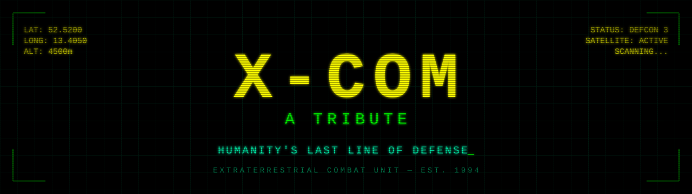

<div align="center">



# X-COM: A Tribute

**A retro-styled tribute website to the XCOM franchise — 30+ years of humanity's last line of defense.**

[](https://highviewone.github.io/xcom-tribute/)
[](LICENSE)


</div>

---

## 📡 Overview

XCOM is one of gaming's most celebrated tactical strategy franchises — challenging players to manage a secret paramilitary organization defending Earth from alien invasion. This single-page tribute spans the entire saga, from the lo-fi isometric brilliance of the **1994 original** by Mythos Games to the polished cinematic tension of the **modern Firaxis era**.

The site is styled after a **classic 90s CRT terminal**: pixel fonts, phosphor-green glow, scanline flicker, and tactical overlays. No frameworks, no build step — just static HTML, CSS, and a sprinkle of vanilla JavaScript.

> _"The beauty of XCOM is that every death means something. You name your soldiers. You watch them grow. And when a Chrysalid takes them in the dark, you feel it."_

## ✨ Features

- **🖥️ Authentic CRT aesthetic** — scanlines, flicker, phosphor glow, and the `VT323` pixel font.
- **📱 Fully responsive** — optimized for desktop and mobile, with a collapsible nav.
- **♿ Accessible** — skip link, `aria` attributes, keyboard focus states, and generous touch targets.
- **🎯 Comprehensive content** — game history, core mechanics, key developers, a milestone timeline, and franchise legacy.
- **⚡ Zero dependencies** — no bundler, no npm install, no server required.
- **🔍 SEO-ready** — Open Graph tags, canonical URL, and JSON-LD structured data.

## 🚀 Getting Started

No build process or server required — just open the file:

```bash
git clone https://github.com/HighviewOne/xcom-tribute.git
cd xcom-tribute
open index.html        # macOS
# or: xdg-open index.html   (Linux) / start index.html (Windows)
```

Prefer a local server (recommended for correct font preloading)?

```bash
python3 -m http.server 8000
# then visit http://localhost:8000
```

## 🗂️ Project Structure

```
xcom-tribute/
├── index.html      # Page markup & content
├── styles.css      # CRT theme, layout, animations
├── script.js       # Nav toggle, scroll effects, animations
├── favicon.svg      # Site icon
├── robots.txt
└── .github/        # Banner, issue & PR templates
```

## 🤝 Contributing

Contributions are welcome! Whether it's fixing a typo, correcting franchise lore, or improving accessibility:

1. Open an [issue](https://github.com/HighviewOne/xcom-tribute/issues) using one of the templates.
2. Fork the repo and create a feature branch.
3. Open a pull request — the [PR template](.github/PULL_REQUEST_TEMPLATE.md) will guide you.

## 📜 Credits

| Role | Attribution |
| --- | --- |
| **Original Series** | Mythos Games / MicroProse (Julian & Nick Gollop) |
| **Modern Series** | Firaxis Games / 2K Games (Jake Solomon) |
| **Fonts** | [Google Fonts](https://fonts.google.com/) — VT323 |
| **Icons** | Unicode glyphs (lightweight, dependency-free) |

## ⚖️ License

This project is licensed under the **MIT License** — see the [LICENSE](LICENSE) file for details.

This is an unofficial, non-commercial fan tribute. XCOM and all related trademarks are property of their respective owners (2K Games / Firaxis Games / MicroProse).

<div align="center">

---

*Permadeath. Overwatch. Panic. Chrysalids. The Geoscape.*

**Made with respect & admiration. 🛸**

</div>
